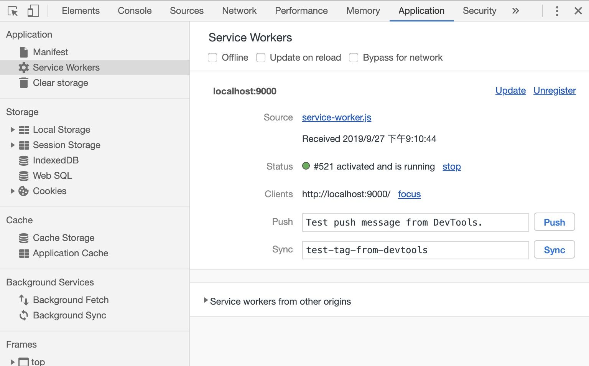

## <center>service worker项目实战一：离线缓存实现</center>
## 前言
学习本教程之前，需要对`[nodejs]()`、`[npm]()`至少有基础的了解，service worker涉及到缓存，所以对`[http]()`缓存也应该有基础的了解。

本文[github](https://github.com/dione2017/service-worker-application)地址，如果对`service worker`有一定的了解，可以直接看具体实现。
## 知识点概括
* service worker简介
* 基于nodejs实现一个简单的静态资源服务器
* 基本的离线缓存实现
* 离线缓存的更新（重点）
* 离线缓存和在线服务的结合

## service worker简介
`service worker`翻译成中文叫做 服务工作线程，它是一个注册在**指定源和路径下**的事件驱动worker, service worker控制的页面或者网站能够拦截并修改访问和资源请求，细粒度地缓存资源，所以用service worker也能够在网络不可用的情况下实现离线缓存。

`service worker`独立于主线程之外的worker上下文，因此它不能访问DOM，所以不会造成阻塞，它设计为完全异步，同步API（如`XHR`和`localStorage`）不能在`service worker`中使用。

`service worker`只能由HTTPS承载，毕竟修改网络请求的能力暴露给中间人攻击会非常危险。在Firefox浏览器的用户隐私模式，`service worker`不可用，另外本地环境localhost也可以用`service worker`。

## 项目目录结构
```
├── README.md
├── package.json
├── public
│   └── favicon.ico
├── server.js
├── src
│   ├── index.css
│   ├── index.html
│   └── index.js
├── sw
│   └── service-worker.js
└── yarn.lock
```
新建文件夹，命名为service-worker。定位到该目录，执行npm init一路回车即可。
安装 `serve-favicon` 和 `express` 两个插件:

```javascript
npm install serve-favicon express nodemon --save-dev
或者：
yarn add serve-favicon express nodemon --dev
```
然后在项目根目录下面创建sw src public 目录，并创建对应的文件。
## 基于nodejs实现一个简单的静态资源服务器
实际项目中我们应该使用`nginx`等来作为静态资源服务器，本示例中简单使用nodejs来实现。

server.js
```javascript
const path = require("path");
const express = require("express");
const favicon = require('serve-favicon');
const app = express();
app.get("*", (req, res, next) => {
  console.log(req.url);
  next();
})
app.use(favicon(path.join(__dirname, "public", "favicon.ico")));
const options = {
  setHeaders (res, filePath, stat) {
    res.set({
      "cache-control": "no-cache"
    })
  }
}
app.use(express.static("src", options));
app.use(express.static("sw", {
  maxAge: 0
}))
app.listen("9000", () => {
  console.log("server start at localhost:9000");
})
```
在server.js文件中，把src目录下的静态资源缓存类型设置为`协商缓存`，客户端每次获取资源都会向服务器验证文件有效性来确认是否使用本地缓存；sw下面的server-worker.js则设置为永久性缓存为0，也就是不缓存，客户端每次都会向服务器获取完整的资源,**server-worker.js一定不能缓存**

在package.json中添加启动命令
```json
"start": "nodemon server.js"
```
## 基本的离线缓存实现
先随便写一点内容到index.html和index.css中。

src/index.html
```html
<!DOCTYPE html>
<html lang="en">
<head>
  <meta charset="UTF-8">
  <meta name="viewport" content="width=device-width, initial-scale=1.0">
  <meta http-equiv="X-UA-Compatible" content="ie=edge">
  <title>service-worker</title>
  <link rel="stylesheet" href="./index.css">
</head>
<body>
  <div class="box">
    <div>hello service worker v1 </div>
  </div>
  <script src="./index.js"></script>
</body>
</html>
```
src/index.css
```css
.box {
  text-align: center;
  color: red;
}
```
然后在index.js中实现`service worker`的注册逻辑，主流浏览器对`service worker`的支持度可以在[caniuse](https://caniuse.com/#search=service%20worker)中查看。

src/index.js
```javascript
function serviceRegister () {
  const { serviceWorker } = navigator;
  if (!serviceWorker) {
    console.warn("your browser not support serviceWorker");
    return;
  }
  window.addEventListener("load", async () => {
    let sw = null;
    const regisration = await serviceWorker.register("./service-worker.js");
    sw = regisration.installing || regisration.waiting || regisration.active;
    sw && sw.addEventListener("statechange", (e) => {
      const { state } = e.target;
      console.log(state);
    });
  });
}
serviceRegister();
```
首先从navigator中获取serviceWorker，然后进行支持度检测。当浏览器资源加载完成之后，调用serviceWorker.register(url, {scope: "xxxx"})注册server worker，url为service workder内容的js文件路径，scope为service worker的控制域，默认值是基于当前的location也就是 /，可以自定义修改。

serviceWorker.register函数返回一个regisration，因为worker是异步注册的，调用register之后不知道处于注册之后的哪个阶段，所以只能用regisration中的installing、waiting、active去获取注册示例，然后给示例添加statechange事件监听状态改变。

那当我注册成功时，怎样查看我注册的sw呢？直接打开 chrome://inspect/#service-workers 就可以查看，在当前浏览器中，正在注册的 SW。另外，还有一个 chrome://serviceworker-internals，用来查看当前浏览器中，所有注册好的sw。另外，在当前页面下打开chrome控制台，切换到application选项，下面有个Service Workers二级选项，可以查看当前的sw状态，下面的Application Cache可以查看当前缓存的版本号。

浏览器打开控制台，然后打开localhost:9000，发可以看到log输出的sw的周期状态改变
```
installed
activating
activated
```
可见第一次注册sw时候，sw会走完installed、activating、activated三个周期，在控制台切换到application/ Service Workers可以看到当前的sw状态如下图：


此时service-worker.js中什么内容都没有，我们往里面添加一部分内容：

service-worker.js
```javascript
const _this = this;
const version = "v1";
const cacheFile = [
  "/",
  "/index.html",
  "index.css",
  "index.js"
]
this.addEventListener("install", (event) => { 
  event.waitUntil(
    caches
    .open(version)
    .then((cache) => {
      return cache.addAll(cacheFile)
    })
  )
})
this.addEventListener("fetch", async (event) => {
  const { request } = event;
  event.respondWith(
    caches
      .match(request.clone())
      .catch(() => {
        return fetch(request.clone()).catch()
      })
  );
});
this.addEventListener("activate", (event) => {
  const wihleList = [version];
  event.waitUntil(
    caches
      .keys()
      .then((keyList) => {
        return Promise.all(
          keyList.map((key) => {
            if (!wihleList.includes(key)) {
              return caches.delete(key);
            }
          })
        )
      })
  )
});
```
在server-worker线程里面，给当前worker添加install、fetch、activate事件。在install事件回掉函数中添加缓存版本号和具体的缓存文件。fetch事件拦截客户端请求，我们首先从缓存中读取内容，如果缓存中找不到则继续向服务器请求。activate中对非当前cache version的缓存进行清理。

service-worker修改完成之后，刷新浏览器，切换到控制台可以看到当前sw状态如图：


嗯，大改的意思就是，老的sw还在服役中，页面的控制权还在老的sw上，新的sw已经安装完成，但是处于未激活状态，没有取得页面的控制权利。关于sw的更新后面会继续讨论，我们手动点击skipWaiting，让新的sw立即激活，然后取得页面控制权。

注意：**在开发调试过程中，我们经常需要在控制台对sw进行 skipWaiting、unRegister、delete cache等操作，但是你不要期望用户会这么做，所以在进行线上版本发布时候，一定要慎重，缓存搞的错乱了，用户加载的内容出错了，可是严重故障...**

手动点击skipWaiting后，看到新的sw已经生效了。刷新浏览器，在network选项中可以看到缓存内容的请求已经被拦截了，从sw缓存中获取了。在chrome控制台中，把network状态改成offline，再次刷新浏览器，嗯，虽然没网了，但是还是可以从本地缓存读取内容。

至此service-worker离线缓存基本原理算是搞清楚了，基本功能也实现了，但是如果要以为这就可以用到生产环境中去，那绝对出大事，因为使用了sw应用的更新可是很有玄妙的。

## 离线缓存的更新
加入了service-worker的应用中，更新分为sw更新和页面资源更新。
### service-worker更新
接着上面的例子，每次service-worker.js更新后，客户端会重新安装新的sw，然后等待老的sw控制的页面都关闭或者整个浏览器都关闭，新的sw才会激活。在sw进程中，提供了skipWaiting 方法，可以跳过新的sw等待状态，直接激活，取得所控制的页面的控制权

src/service-worker.js
```javascript
...
const version = "v2";
...
this.addEventListener("install", (event) => { 
  this.skipWaiting();
  ...
})
```
添加skipWaiting()，同时把缓存 version 改为v2，把浏览器控制台network改为online，再次刷新浏览器。查看控制台的application，sw已经没有了skipWaiting状态，新的sw安装完成之后立即被激活了。使用skipWaiting之后也会产生一系列问题：

* 浏览器在后台主动更新的sw，同时sw会缓存新的文件，下一次用户访问url时候，直接获取新的缓存。如果更新sw是由用户访问url触发的，由于sw注册和安装更新是独立线程异步的，则此时我们的url打开时候，还是由老旧的sw控制，所以获取的也是老旧的资源。

修改src/index.html
```html
 <div>hello service worker v3 </div>
```
修改sw/service-worker.js
```javascript
const version = "v3";
```
刷新浏览器，新的sw已经激活了，可是页面上还是hello service worker v1，再次刷新才能是hello service worker v3。

解决方案：**注册service worker时候，添加controllerchange事件，当监听到新的sw取得页面控制权时候，主动刷新页面或者以消息形式通知用户刷新浏览器**

很明显这种方法虽然可行，但是直接被否决，主动刷新页面太暴力，通知用户刷新浏览器结果不可控。

* 老的sw和新的sw可能不太一样，替换之后容易引起很多未知错误，这种错误不可控且很难复现。

* sw没有更新，但是资源更新了，用户访问url还是走的老的sw缓存。
修改src/index.html
```html
 <div>hello service worker v4 </div>
```
刷新浏览器，页面内容还是hello service worker v3。

### 离线缓存和在线服务的结合
鉴于离线缓存更新带来的各种问题，我思考许久，同时也看了service worker在其他著名企业的产品上的应用，最终思考出了一个方案：在sw控制的页面中，优先使用在线资源，sw充当本地和线上服务器的代理服务器角色；当在线资源获取出错（服务器宕机，网络不可用等情况），则使用sw本地缓存。

html文件优先从线上获取，获取之后设置缓存，以便下一次获取html出错时候再从本地缓存获取的是上一次获取的文件。总之，当能够获取到服务器资源时候，我们要保证html一直是最新的，因为html里面的各种js，css资源等，都会添加版本号，所以这些js、css的资源请求也会是正确的对应的版本号，除了html文件之外的资源，我们优先从本地获取，本地获取不到再从线上获取并且缓存请求，以便下一次使用(实际项目中应该根据cachefile也就是自己的缓存文件进行资源uri比较判断是否该缓存，本地cache storage空间优先，不可能缓存所有的非html请求)


```javascript
function setCache (req, res) {
  caches
    .open(version)
    .then((cache) => {
      cache.put(req, res);
    })
}
this.addEventListener("fetch", async (event) => {
  const { request } = event;
  if (request.headers.get("Accept").indexOf("text/html") !== -1) {
    event.respondWith(
      fetch(request.clone())
      .then((response) => {
        if (response) {
          setCache(request.clone(), response.clone())
          return response.clone();
        }
        return caches.match(request.clone());
      }).catch((e) => {
        return caches.match(request.clone());
      })
    )
    return;
  }
  event.respondWith(
    caches
      .match(request.clone())
      .then((response) => {
        if (response) {
          return response;
        }
        return (
          fetch(request.clone())
          .then((fetchResponse) => {
            // 对于非html资源，实际项目中不应该缓存所有的请求，毕竟本地cache storage有限
            // 应该对请求的资源和cacheFile进行对比，如果匹配则缓存，如果不匹配，
            // 则此处fetch仅仅充当服务请求中转的作用
            setCache(request.clone(), fetchResponse.clone());
            return fetchResponse.clone();
          })
        );
      }).catch((e) => {
        console.log(e);
      })
  );
});
```
修改service-worker.js之后，我们在控制台把sw给unregister了，并且把cache storage里面的缓存清理掉，并且把html中的内容改为hello service worker v1，再把service-worker.js中的verson改为v1，然后刷新页面，相当于用户第一次访问url进行sw注册。

之后就可以进行各种操作了，比如html内容修改、sw里面的缓存version修改或者sw其他内容修改、或者断网操作，或者自己清除cache storage请求等，每次操作之后刷新浏览器，看看效果并且好好思考结果和为什么吧！

注意：**本示例的index.js index.css没有添加版本号，如果要修改里面的内容，修改之后得加个版本号，要不然获取的是缓存中的老旧资源**

**在开发调试过程中，我们经常需要在控制台对sw进行 skipWaiting、unRegister、delete cache等操作，要在多个场景下去观察和思考sw的状态和改变，并且根据自己的业务想象出缓存方案**

基本的离线缓存方案实现了，但是仅仅还是demo阶段，实际应用中，比如我们有三方cdn，而且自己的项目经过诸如`webpack`等打包之后各种资源都带版本号，每次都手动修改service-worker.js那是不现实的，而且非常容易出错。serviceWorker结合webpack等工具应用到生产环境上，还有需要做更多的事情。

下一篇将讲述 serviceWorker 结合 webpack 自动生成离线缓存应用。

本文[github]地址(https://github.com/dione2017/service-worker-application)，如果有帮助欢迎star，如果您能提出宝贵意见建议或者issue那就更好了。